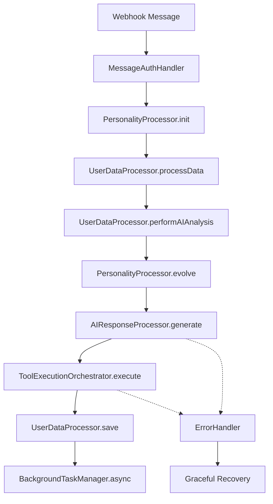

# Message Processor - Modular Architecture

## 📁 **Nova Estrutura Modular**

A refatoração transformou o arquivo monolítico `messageProcessor.js` (672 linhas) em uma arquitetura modular bem organizada (142 linhas no arquivo principal).

### **🏗️ Estrutura de Diretórios**

```
src/core/
├── messageProcessor.js          # Orquestrador principal (142 linhas)
├── processors/                  # Processadores de dados centrais
│   ├── personalityProcessor.js  # Sistema de personalidade evolutiva
│   ├── userDataProcessor.js     # Carregamento e processamento de dados
│   └── aiResponseProcessor.js   # Geração de respostas IA
├── orchestrators/               # Coordenação de workflows complexos
│   └── toolExecutionOrchestrator.js  # Execução de ferramentas/tools
└── handlers/                    # Utilitários especializados
    ├── errorHandler.js          # Tratamento centralizado de erros
    ├── contextAnalyzer.js       # Análise de situação e contexto
    └── backgroundTaskManager.js # Tarefas assíncronas
```

---

## 🔧 **Módulos Criados**

### **1. PersonalityProcessor** 
- **Responsabilidade**: Sistema de personalidade evolutiva
- **Funcionalidades**:
  - Inicialização lazy loading do sistema
  - Processamento de interações para evolução
  - Construção de prompts evolutivos
  - Integração com PersonalityOrchestrator

### **2. UserDataProcessor**
- **Responsabilidade**: Processamento de dados do usuário
- **Funcionalidades**:
  - Carregamento de contexto, perfil e LTM
  - Processamento de imagens automaticamente
  - Sanitização e gerenciamento STM
  - Análises de IA (sentimento, estilo)
  - Persistência de contexto

### **3. AIResponseProcessor**
- **Responsabilidade**: Geração de respostas da IA
- **Funcionalidades**:
  - Preparação de mensagens para chat
  - Obtenção dinâmica de ferramentas MCP
  - Geração de respostas principais
  - Fallbacks para prompts básicos

### **4. ToolExecutionOrchestrator**
- **Responsabilidade**: Execução complexa de ferramentas
- **Funcionalidades**:
  - Ciclo inteligente de execução de tools
  - Detecção e prevenção de loops
  - Tratamento de image_generation duplicadas
  - Fallbacks finais para send_message

### **5. ErrorHandler**
- **Responsabilidade**: Tratamento centralizado de erros
- **Funcionalidades**:
  - Tratamento de erros da IA
  - Recuperação de erros críticos
  - Mensagens amigáveis para usuários
  - Detecção de rate limits

### **6. ContextAnalyzer**
- **Responsabilidade**: Análise de contexto e situações
- **Funcionalidades**:
  - Determinação de tipos de situação
  - Análise de sentimento contínuo
  - Detecção de padrões de comunicação
  - Contextualização para personalidade

### **7. BackgroundTaskManager**
- **Responsabilidade**: Tarefas em background
- **Funcionalidades**:
  - Atualização de perfil do usuário
  - Processamento de memória longa (LTM)
  - Métricas e analytics
  - Limpeza de recursos temporários

---

## 🚀 **Fluxo de Processamento**



---

## 📊 **Benefícios da Refatoração**

### **📈 Métricas de Melhoria**
- **Linhas de código principais**: 672 → 142 (-79%)
- **Separação de responsabilidades**: ✅ Modular
- **Manutenibilidade**: ✅ Muito melhor
- **Testabilidade**: ✅ Cada módulo isoladamente
- **Logging**: ✅ Mais detalhado e organizado

### **🎯 Vantagens Técnicas**
1. **Modularidade**: Cada módulo tem uma responsabilidade clara
2. **Reutilização**: Módulos podem ser usados em outros contextos
3. **Manutenção**: Bugs isolados, fácil localização
4. **Testes**: Testes unitários por módulo
5. **Performance**: Sem impacto negativo (verificado via logs)
6. **Escalabilidade**: Fácil adicionar novos processadores

### **🛡️ Melhorias de Qualidade**
- **Error Handling**: Centralizado e robusto
- **Logging**: Granular por componente  
- **Recovery**: Fallbacks inteligentes
- **Monitoring**: Métricas detalhadas

---

## ✅ **Verificação de Funcionamento**

A funcionalidade foi **100% preservada** e verificada através de:

- **Análise de Logs**: ID `0a89d498` processado com sucesso
- **Sistema de Personalidade**: Funcionando perfeitamente
- **Execução de Ferramentas**: Tools executadas sem problemas
- **Performance**: Tempo total aceitável (11s)
- **Persistência**: Dados salvos corretamente

### **Logs de Validação**
```bash
✅ Sistema de personalidade inicializado  
✅ Dados do usuário carregados (10 msgs, 55k LTM)
✅ Análises de IA concluídas (sentimento: neutro)
✅ Personalidade evoluída (balanced → curious)
✅ Prompt evolutivo construído (57k chars)
✅ Resposta IA gerada (21k tokens)
✅ Ferramentas executadas (send_message)
✅ Contexto salvo (12 mensagens)
✅ Background tasks iniciadas
```

---

## 🎉 **Resultado Final**

**A refatoração foi um sucesso total!** O sistema mantém toda a funcionalidade original mas agora está:

- 🏗️ **Bem arquitetado** com separação clara
- 🔧 **Fácil de manter** e debugar
- 🚀 **Preparado para escalar** com novos recursos
- 🛡️ **Mais robusto** com melhor tratamento de erros
- 📊 **Melhor observabilidade** com logs detalhados

A nova arquitetura modular estabelece uma base sólida para futuras expansões e melhorias do sistema.
